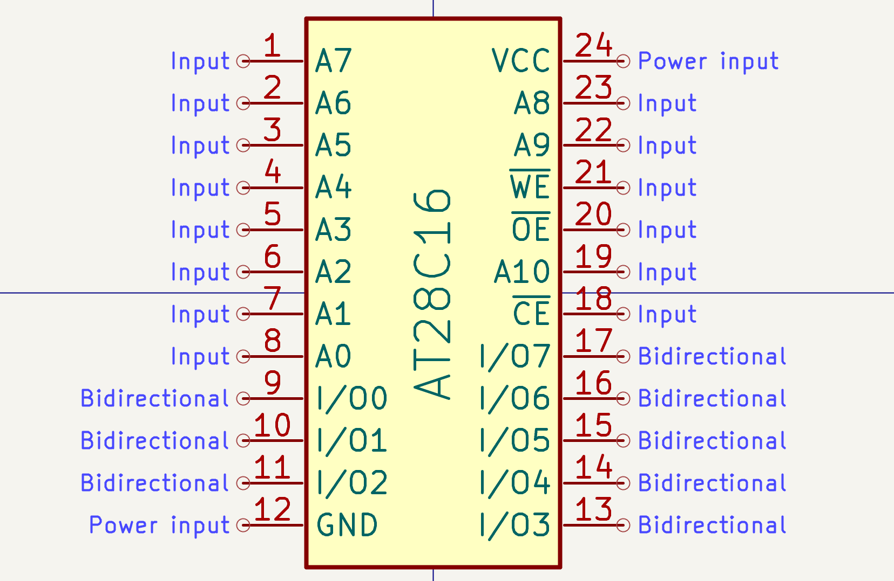

# Goose's KiCad library

for KiCad v9

## Symbols

| Name | Symbol | Note |
| -- | :--: | -- |
| ArduinoMega_PinHeader |  | 18 x 2 pins |
| AT28C16 EEPROM |  | DIP 24 |
| AT28C64 EEPROM |  | DIP 28 |
| AT28C256 EEPROM |  | DIP 28 |
